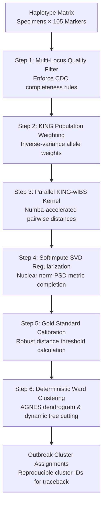

# PyEuk's Distance and Clustering Path, Step by Step

This document outlines the step-by-step computational workflow used by **PyEuk** to process *Cyclospora cayetanensis* multi-locus sequence typing (MLST) data into deterministic foodborne outbreak clusters.

---

## Workflow Overview

---

## Step 1: Specimen Quality and Multi-Locus Completeness Filtering

Clinical specimens frequently suffer from partial sequencing dropouts due to low parasite oocyst burden in stool samples. Before computing genetic distances, PyEuk applies strict quality filters to ensure robust distance estimation.

* **Input Data**: A binary presence/absence matrix across 105 amplicon windows representing 8 targeted nuclear and mitochondrial genomic loci (`Mt_Cmt`, `Mt_MSR`, `Nu_360i2`, `Nu_378`, and `Nu_CDS1` through `Nu_CDS4`).
* **Completeness Rule**: A specimen must have valid haplotype calls across at least 4 to 5 base loci, including key diagnostic trios such as:
  * `Mt_Cmt` + `Mt_MSR` + `Nu_360i2`
  * `Mt_Cmt` + `Mt_MSR` + `Nu_378`
  * `Mt_MSR` + `Nu_360i2` + `Nu_378`
  * `Mt_Cmt` + `Nu_360i2` + `Nu_378`
* **Outcome**: Low-coverage samples that fail these criteria are filtered out before distance estimation to prevent skewed population allele frequencies.

---

## Step 2: Population Genetics Allele Weighting (KING Framework)

In molecular surveillance, sharing a rare haplotype is strong evidence of a common outbreak source, whereas sharing an ultra-common background allele is expected by chance. 

1. **Cohort Allele Frequency**: For each marker window $j$, PyEuk calculates its empirical frequency $p_j$ across the surveillance cohort:

   $$p_j = \frac{1}{N} \sum_{i=1}^{N} X_{ij}$$

2. **Inverse-Variance Weighting**: Borrowing from human kinship estimation (the KING framework), PyEuk weights each marker by its inverse binomial standard deviation:

   $$w_j = \frac{1}{\sqrt{p_j (1 - p_j)}}$$

* **Impact**: Rare alleles are dynamically upweighted, while common, uninformative background alleles are downweighted.

---

## Step 3: High-Speed Parallel Pairwise Distance (KING-wIBS)

PyEuk computes the pairwise Weighted Identity-By-State (wIBS) genetic dissimilarity between all eligible specimen pairs:

$$\mathbf{D}_{\text{wIBS}}(i, j) = \frac{\sum_{k=1}^{M} w_k \cdot \mathbb{I}(X_{ik} \neq X_{jk})}{\sum_{k=1}^{M} w_k}$$

### Key Advantages:
* **Resolving the High-MOI Paradox**: *Cyclospora* infections often contain multiple strains per patient (high Multiplicity of Infection, or MOI). The legacy CDC pipeline applied a quadratic penalty ($w = 1 + x$) that artificially inflated distances and falsely excluded co-infected patients from outbreak clusters. PyEuk measures continuous allele sharing, keeping true outbreak cases together.
* **Parallel C Acceleration**: Computations run through a multi-threaded Numba-JIT C-kernel, processing over 580,000 pairwise comparisons in **under 50 milliseconds**.

---

## Step 4: SoftImpute SVD Matrix Completion (Euclidean Metric Guarantee)

Missing marker data in amplicon panels can cause distance matrices to violate triangle inequality, resulting in negative eigenvalues ($\lambda_{\min} < 0$). Feeding non-Euclidean matrices into hierarchical clustering distorts branch lengths and tree topology.

PyEuk guarantees positive semi-definiteness (PSD) through **SoftImpute SVD** matrix completion:

$$\min_{\mathbf{Z}} \frac{1}{2} \|\mathbf{P}_\Omega(\mathbf{X} - \mathbf{Z})\|_F^2 + \lambda \|\mathbf{Z}\|_*$$

1. Singular values are regularized via soft-thresholding:

   $$S_{\text{soft}} = \max(S - \lambda, 0)$$

2. The matrix diagonal is reset to zero and symmetrized.
3. **Result**: The final distance matrix is guaranteed to be a valid Euclidean metric space ($\lambda_{\min} \ge 0.0$), satisfying the mathematical prerequisites of Ward's clustering.

---

## Step 5: Gold Standard Distance Threshold Calibration

Rather than using an arbitrary distance cutoff, PyEuk calibrates its outbreak boundary using epidemiologically confirmed historical outbreak pairs (e.g., CDC reference outbreak clusters).

1. All pairwise genetic distances between confirmed outbreak pairs are extracted.
2. The maximum allowable intra-cluster distance threshold is calculated using robust statistics:

   $$\text{Threshold} = \text{Median}_{\text{gold}} + 3 \times 1.4826 \times \text{MAD}_{\text{gold}}$$

   *(or classical parametric: $\text{Mean}_{\text{gold}} + 3\sigma_{\text{gold}}$)*

* **Purpose**: This threshold defines the genetic boundary of an epidemiological cluster.

---

## Step 6: Deterministic Ward Hierarchical Clustering & Tree Cutting

Using the regularized PSD distance matrix and calibrated threshold, PyEuk isolates discrete outbreak clusters:

1. **Agglomerative Hierarchical Clustering (AGNES)**: Constructs a cluster hierarchy using Ward's minimum variance criterion:

   $$\Delta \text{ESS}(A, B) = \frac{n_A n_B}{n_A + n_B} \|\mathbf{m}_A - \mathbf{m}_B\|^2$$

2. **100% Deterministic Tie-Breaking**: Replaces legacy R's random tie-breaking (`ties.method = "random"`) with strict lexicographical sorting, guaranteeing reproducible cluster assignments across independent runs.
3. **Dynamic Tree Cut Search**: PyEuk iterates across cluster counts ($k = 1 \dots 50$), cutting the dendrogram to identify the smallest cluster count $k$ where **at least 95% of all within-cluster pairwise distances fall strictly below the calibrated gold-standard threshold**.

---

## Summary of Outputs

The final output is a clean tabular file mapping each patient isolate to a validated outbreak cluster ID:

| Specimen ID | Assigned Cluster | Outbreak Concordance |
| :--- | :--- | :--- |
| `TX_2018_001` | Cluster 1 | Verified Outbreak Member |
| `TX_2018_002` | Cluster 1 | Verified Outbreak Member |
| `IA_2018_045` | Cluster 2 | Verified Outbreak Member |
| `SPORADIC_088`| Sporadic / Unclustered | Isolated Single Case |

This workflow delivers reliable, mathematically sound, and fully reproducible cluster assignments to support food safety investigations and traceback efforts.
